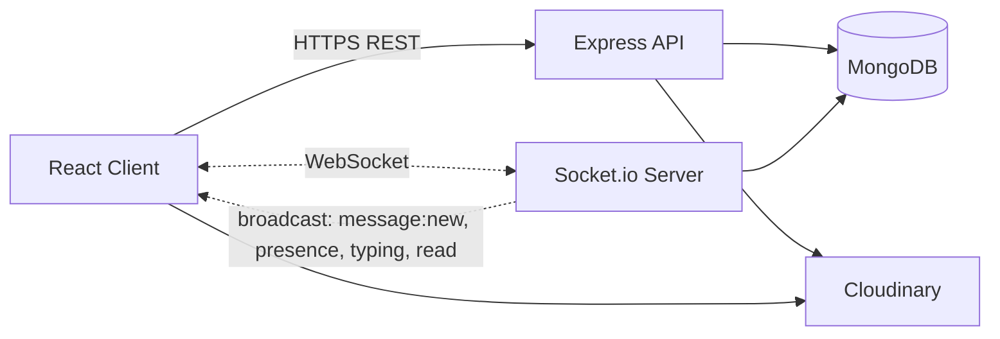

# Chat App — MERN + Socket.io

> **Production-grade real-time chat platform** built on the MERN stack with Socket.io.
> Features 1-1 and group messaging, presence, typing indicators, read receipts, image
> uploads, emoji reactions, message edit/delete, browser notifications, granular privacy
> controls, theming, and a full admin moderation surface — all hardened with a
> defense-in-depth security model.


---

## Live Demo

| Surface  | URL                                                          |
| -------- | ------------------------------------------------------------ |
| Frontend | `https://<your-netlify-domain>` _(replace after deployment)_ |
| API      | `https://<your-render-domain>/api`                           |
| Health   | `https://<your-render-domain>/api/health`                    |

> Deployment instructions live in [STEP 38](./STEPS.md#step-38--deployment-atlas-cloudinary-render-with-websocket-netlify) of the build guide.

---

## Screenshots

| Chat list                              | Conversation                              |
| -------------------------------------- | ----------------------------------------- |
|  |  |

| Group settings                                       | Admin dashboard                                  |
| ---------------------------------------------------- | ------------------------------------------------ |
|  |  |

> Drop PNG/WebP captures into `docs/screenshots/` to enable the previews above.
> Captures must **not** include real user data, real tokens, or admin credentials.

---

## Features

- **Real-time messaging** — direct (1-1) and group conversations over Socket.io.
- **Presence** — online/offline indicator with per-user privacy toggle.
- **Typing indicators** — auto-expire after 5 s; cleared on disconnect or focus loss.
- **Read receipts** — single ✓ delivered, double ✓✓ read; receiver privacy toggle.
- **Browser notifications + in-app sound** — suppressed for the active conversation and muted threads.
- **Image messages** — Cloudinary upload pipeline with MIME whitelist and 5 MB cap.
- **Emoji reactions** — single click toggle, deduped per `(user, emoji, message)`.
- **Message edit (15 min) and delete (5 min for everyone)** — windows enforced server-side.
- **User search, block, conversation mute & archive.**
- **Group chats** — admin roles, rename, member add/remove, last-admin protection.
- **Reporting & admin moderation** — report queue, force-delete, audit log, force-disconnect on suspend.
- **Themes & accessibility** — light/dark, font size, density, reduced motion.
- **Production-grade security** — see the [Security](#security) section below.

---

## WebSocket vs HTTP

> HTTP is request/response and stateless: the client must poll to discover new data.
> WebSocket establishes a single long-lived TCP connection upgraded from HTTP, enabling
> the server to push events to the client (and vice versa) with low latency and no
> polling overhead. We use **HTTP** for everything that is naturally request/response
> (auth, listing conversations, history pagination, uploads, admin), and **WebSocket
> (Socket.io)** for events that benefit from server-push: new messages, presence,
> typing, read receipts, group changes, and notifications. This keeps the API
> REST-friendly and cacheable while delivering real-time UX.

---

## Architecture



**Key invariants**

- The Express API and Socket.io server share **one HTTP server, one port, one CORS policy** (single source of truth for origin/credentials).
- The server is the **single source of truth for socket room membership**. `socket.join` / `socket.leave` are never called from client input — every join is the result of a DB-verified participant lookup.
- Cloudinary uploads are server-mediated: the client sends the file to `/api/upload/*`, the server validates and uploads, then returns the canonical URL. Message bodies only accept image URLs whose host matches the configured Cloudinary CDN.

---

## Roles & Permissions

| Action                                  | User | Admin |
| --------------------------------------- | :--: | :---: |
| Create direct/group conversation        |  ✓   |   ✓   |
| Send / edit (own, 15 min) own message   |  ✓   |   ✓   |
| Delete own message                      |  ✓   |   ✓   |
| Delete any message                      |  ✗   |   ✓   |
| Suspend / reinstate user                |  ✗   |   ✓   |
| Promote / demote user role              |  ✗   |   ✓   |
| View any conversation (audit-logged)    |  ✗   |   ✓   |
| Resolve reports                         |  ✗   |   ✓   |
| Block / unblock another user            |  ✓   |   ✓   |
| Mute / archive a conversation           |  ✓   |   ✓   |
| Report a user, message, or conversation |  ✓   |   ✓   |

---

## API Endpoints

> Base URL: `${VITE_API_URL}` (e.g. `http://localhost:5000/api` in development).
> All authenticated routes require `Authorization: Bearer <jwt>`.

### Health

| Method | Path          | Description                |
| ------ | ------------- | -------------------------- |
| GET    | `/api/health` | Liveness probe (no auth).  |

### Auth — `/api/auth`

| Method | Path        | Auth | Description                                             |
| ------ | ----------- | :--: | ------------------------------------------------------- |
| POST   | `/register` |  —   | Create account (rate-limited).                          |
| POST   | `/login`    |  —   | Issue JWT (rate-limited).                               |
| GET    | `/me`       |  ✓   | Current user profile + preferences.                     |
| PATCH  | `/profile`  |  ✓   | Update `displayName`, `bio`, `avatarUrl`.               |
| PATCH  | `/password` |  ✓   | Requires current password + complexity check.           |
| DELETE | `/account`  |  ✓   | Anonymizes messages, removes from conversations.        |

### Users — `/api/users`

| Method | Path                  | Auth | Description                                  |
| ------ | --------------------- | :--: | -------------------------------------------- |
| GET    | `/search?q=`          |  ✓   | Username/displayName prefix search.          |
| GET    | `/me/blocked`         |  ✓   | List of blocked users.                       |
| PATCH  | `/me/preferences`     |  ✓   | Theme, density, privacy, notifications, …    |
| POST   | `/:userId/block`      |  ✓   | Block a user.                                |
| DELETE | `/:userId/block`      |  ✓   | Unblock a user.                              |
| GET    | `/:username`          |  ✓   | Public profile by username.                  |

### Conversations — `/api/conversations`

| Method | Path                            | Auth | Description                                   |
| ------ | ------------------------------- | :--: | --------------------------------------------- |
| GET    | `/`                             |  ✓   | Paginated list (`page`, `limit`, `archived`). |
| GET    | `/unread-summary`               |  ✓   | Per-conversation unread counts.               |
| POST   | `/direct`                       |  ✓   | Find-or-create a 1-1 conversation.            |
| POST   | `/group`                        |  ✓   | Create a new group.                           |
| GET    | `/:id`                          |  ✓   | Conversation detail.                          |
| PATCH  | `/:id`                          |  ✓   | Rename / change avatar (group, admin only).   |
| DELETE | `/:id`                          |  ✓   | Leave / delete conversation.                  |
| POST   | `/:id/members`                  |  ✓   | Add members (group admin).                    |
| DELETE | `/:id/members/:userId`          |  ✓   | Remove member (group admin).                  |
| POST   | `/:id/admins/:userId`           |  ✓   | Promote to admin (group admin).               |
| DELETE | `/:id/admins/:userId`           |  ✓   | Demote admin (last-admin protected).          |
| POST   | `/:id/mute`                     |  ✓   | Toggle mute for current user.                 |
| POST   | `/:id/archive`                  |  ✓   | Toggle archive for current user.              |
| POST   | `/:id/read`                     |  ✓   | Mark conversation as read up to latest.       |

### Messages

| Method | Path                                          | Auth | Description                                |
| ------ | --------------------------------------------- | :--: | ------------------------------------------ |
| GET    | `/api/conversations/:id/messages`             |  ✓   | Cursor pagination via `?before=<msgId>`.   |
| POST   | `/api/conversations/:id/messages`             |  ✓   | Send a message (rate-limited).             |
| GET    | `/api/conversations/:id/messages/search?q=`   |  ✓   | Full-text search inside a conversation.    |
| PATCH  | `/api/messages/:id`                           |  ✓   | Edit own message (≤ 15 min).               |
| DELETE | `/api/messages/:id`                           |  ✓   | Delete `for-me` (any time) / `everyone` (≤ 5 min). |
| POST   | `/api/messages/:id/reactions`                 |  ✓   | Toggle reaction with `{ emoji }`.          |

### Uploads — `/api/upload`

| Method | Path             | Auth | Description                                      |
| ------ | ---------------- | :--: | ------------------------------------------------ |
| POST   | `/avatar`        |  ✓   | `multipart/form-data` field `file` (≤ 5 MB).     |
| POST   | `/message-image` |  ✓   | Same constraints; returns Cloudinary URL.        |

### Notifications — `/api/notifications`

| Method | Path             | Auth | Description                                  |
| ------ | ---------------- | :--: | -------------------------------------------- |
| GET    | `/`              |  ✓   | Paginated notification list.                 |
| GET    | `/unread-count`  |  ✓   | Number badge for the bell icon.              |
| PATCH  | `/read-all`      |  ✓   | Mark every notification as read.             |
| PATCH  | `/:id/read`      |  ✓   | Mark a single notification as read.          |
| DELETE | `/:id`           |  ✓   | Dismiss a notification.                      |

### Reports — `/api/reports`

| Method | Path | Auth | Description                                                   |
| ------ | ---- | :--: | ------------------------------------------------------------- |
| POST   | `/`  |  ✓   | File a report. Listing/fetching is admin-only (see below).    |

### Admin — `/api/admin` _(role: `admin`, additional rate limit)_

| Method | Path                                | Description                                        |
| ------ | ----------------------------------- | -------------------------------------------------- |
| GET    | `/stats`                            | Counts: users, online, conversations, messages, … |
| GET    | `/users`                            | List/search users (filters: status, role, query). |
| GET    | `/users/:id`                        | User detail with related counts.                   |
| PATCH  | `/users/:id/status`                 | `active` / `suspended` (audit-logged).             |
| PATCH  | `/users/:id/role`                   | `user` / `admin` (last-admin protected).           |
| DELETE | `/users/:id`                        | Hard-delete + cascade cleanup.                     |
| GET    | `/reports`                          | Moderation queue with filters.                     |
| GET    | `/reports/:id`                      | Report detail with target preview.                 |
| PATCH  | `/reports/:id`                      | Resolve / dismiss with `reviewNote`.               |
| DELETE | `/messages/:id`                     | Force-delete any message; emits `message:deleted`. |
| GET    | `/conversations/:id/messages`       | Audit window into any conversation (logged).       |

---

## Socket Events

> Socket connection requires the JWT in the handshake (`auth: { token }`).
> Suspended users are disconnected immediately; deleted users cannot reconnect.

### Client → Server

| Event                  | Payload (typed shape)                                              | Ack                              | Description                                  |
| ---------------------- | ------------------------------------------------------------------ | -------------------------------- | -------------------------------------------- |
| `message:send`         | `{ conversationId, type, text?, imageUrl?, replyTo? }`             | `{ ok, message }`                | Persist + broadcast a new message.           |
| `message:edit`         | `{ messageId, text }`                                              | `{ ok, message }`                | ≤ 15 min, sender only.                       |
| `message:delete`       | `{ messageId, scope: 'me' \| 'everyone' }`                         | `{ ok }`                         | `everyone` ≤ 5 min, sender only.             |
| `message:reaction`     | `{ messageId, emoji }`                                             | `{ ok, reactions }`              | Toggle user's reaction.                      |
| `conversation:read`    | `{ conversationId, lastReadMessageId? }`                           | `{ ok }`                         | Updates per-user `lastRead`.                 |
| `conversation:open`    | `{ conversationId }`                                               | `{ ok }`                         | Suppresses notifications for this thread.    |
| `conversation:close`   | `{ conversationId }`                                               | `{ ok }`                         | Re-enables notifications for this thread.    |
| `typing:start`         | `{ conversationId }`                                               | —                                | Broadcast to other participants.             |
| `typing:stop`          | `{ conversationId }`                                               | —                                | Manual stop (auto-stop after 5 s).           |
| `presence:list`        | `{ userIds: string[] }`                                            | `{ online: string[] }`           | Snapshot lookup, e.g. for the chat sidebar.  |

### Server → Client

| Event                      | Payload                                                                       | Description                                  |
| -------------------------- | ----------------------------------------------------------------------------- | -------------------------------------------- |
| `message:new`              | `{ message }`                                                                 | Fan-out to `conv:<id>` participants.         |
| `message:edited`           | `{ message }`                                                                 | New text + `editedAt`.                       |
| `message:deleted`          | `{ messageId, conversationId, scope }`                                        | Redact bubble client-side.                   |
| `message:reactionUpdated`  | `{ messageId, reactions }`                                                    | Aggregated reactions per emoji.              |
| `conversation:readBy`      | `{ conversationId, userId, lastReadMessageId, readAt }`                       | Powers ✓✓ ticks.                             |
| `userOnline`               | `{ userId }`                                                                  | Privacy-aware (skipped if user opted out).   |
| `userOffline`              | `{ userId, lastSeenAt }`                                                      | Privacy-aware.                               |
| `typing:start`             | `{ conversationId, userId }`                                                  | Excludes the typing user.                    |
| `typing:stop`              | `{ conversationId, userId }`                                                  |                                              |
| `notification:new`         | `{ notification }`                                                            | Direct fan-out to `user:<id>`.               |
| `group:created`            | `{ conversation }`                                                            | Sent to every member's personal room.        |
| `group:memberAdded`        | `{ conversationId, addedBy, members }`                                        |                                              |
| `group:memberRemoved`      | `{ conversationId, removedBy, userId }`                                       |                                              |
| `group:youWereRemoved`     | `{ conversationId, removedBy }`                                               | Direct to the affected user.                 |
| `group:updated`            | `{ conversationId, name?, avatarUrl?, updatedBy }`                            |                                              |
| `group:adminChanged`       | `{ conversationId, userId, action: 'promoted' \| 'demoted', actorId }`        |                                              |
| `server:error`             | `{ message }`                                                                 | Connection-time setup failure.               |

---

## Folder Structure

```
.
├── client/                         # React 19 + Vite SPA
│   ├── public/                     # Static assets (favicon, sounds)
│   └── src/
│       ├── api/                    # Axios instance + per-resource services
│       ├── components/
│       │   ├── admin/              # Stats cards, user/report rows
│       │   ├── chat/               # Composer, list, bubbles, modals
│       │   ├── common/             # Reusable UI primitives
│       │   ├── guards/             # Route guards (auth, admin)
│       │   ├── layout/             # App shell, navigation
│       │   └── modals/             # Confirm, image lightbox, …
│       ├── contexts/               # Auth, Socket, Chat, Preferences, Notifications
│       ├── hooks/                  # useDebounce, useInfiniteScroll, …
│       ├── layouts/                # Page-level shells
│       ├── pages/                  # Route components (auth, chat, admin, settings, …)
│       ├── utils/                  # Pure helpers
│       ├── App.jsx                 # Router + providers
│       ├── index.css               # Tailwind v4 theme + tokens
│       └── main.jsx                # Entry point
│
├── server/                         # Express 5 + Socket.io API
│   ├── config/                     # env, db, socket bootstrap
│   ├── controllers/                # HTTP handlers (thin)
│   ├── middlewares/                # auth, rate limit, sanitize, errors, upload
│   ├── models/                     # Mongoose 9 schemas
│   ├── routes/                     # Route definitions (one per resource)
│   ├── scripts/                    # seedAdmin, …
│   ├── sockets/                    # auth, presence, typing, message, group, rooms
│   ├── utils/                      # services, serializers, helpers
│   ├── validators/                 # express-validator chains
│   └── index.js                    # App bootstrap (HTTP + Socket.io on one port)
│
├── STEPS.md                        # Full build guide (38 steps)
└── README.md                       # You are here
```

---

## Security

> A condensed view of the [STEP 19 audit](./STEPS.md#step-19--backend-validation--comprehensive-security-audit).
> Every item below is implemented and exercised by the production build.

**Transport & headers**
- `helmet()` with secure defaults (HSTS, `X-Content-Type-Options`, `X-Frame-Options`, …).
- `x-powered-by` disabled.
- Strict CORS bound to `CLIENT_URL`; explicit method allow-list; no wildcard.
- `compression()` enabled.
- Body limits: `express.json({ limit: '100kb' })` and `urlencoded` matching.

**Authentication & sessions**
- Passwords hashed with **bcrypt cost 12**, schema `select: false`.
- Generic `401 Invalid email or password` to defeat user enumeration.
- JWT in `Authorization: Bearer` only — no cookies, no query strings.
- `JWT_SECRET` minimum length enforced at startup; default values rejected in production.
- Account deletion and password change require the current password.

**Input hygiene**
- `express-validator` chains on every route — `escape()` on text fields.
- Custom `sanitizeRequest` middleware strips `$` / `.` from `req.body` and `req.params` (Express 5–safe; never touches `req.query`).
- Mongoose ObjectId validation on every `:id` route param.
- Allow-list validation for `preferences` rejects unknown keys.
- All `$regex` searches escape user input via `escapeRegex()` to defeat ReDoS.

**Authorization**
- `protect` middleware re-fetches the user on every request — suspended users are blocked instantly.
- `adminOnly` gate on `/api/admin/*`, plus a dedicated `adminLimiter`.
- `assertParticipant`, `assertGroupAdmin`, `assertOwnership` checks on every mutation.
- Mass-assignment proof: controllers destructure only allowed fields (`role`, `status`, `email`, `password` are never settable from public routes).
- Last-admin protection: cannot demote/delete the only admin in a group or system-wide.
- Admin self-protection: cannot suspend/demote/delete self; cannot suspend another admin from API.

**Real-time layer**
- Socket handshake authenticated by the same `socketAuthMiddleware`; user re-fetched from DB.
- `maxHttpBufferSize: 1e6` (1 MB).
- `socket.join` / `socket.leave` only invoked from server logic — clients can never subscribe to rooms they don't belong to.
- Suspending a user immediately calls `io.to('user:<id>').disconnectSockets(true)`.
- Block enforcement re-checked from the DB on every `message:send` event.

**Rate limiting**
- Separate buckets: `globalLimiter` (`/api`), `authLimiter`, `messageLimiter`, `uploadLimiter`, `adminLimiter`.

**Uploads**
- MIME whitelist (`image/jpeg | png | webp`); 5 MB cap; `multer.memoryStorage`.
- Server-generated Cloudinary `publicId`; image URLs in messages must match the configured Cloudinary CDN host.

**Privacy & content rules**
- `showOnlineStatus` and `showReadReceipts` enforced **server-side** in presence/read events.
- Soft-delete (`deletedFor: 'everyone'`) returns empty `text`/`imageUrl` even though the row remains.
- Edit (15 min) and delete-for-everyone (5 min) windows are checked server-side via `Date.now() - createdAt`.

**Operations**
- Production error handler returns `{ success, message }` only — no stack, no Mongoose internals, no paths.
- Admin moderation actions persisted to a write-only `AdminAuditLog`.
- Report cooldown: same `(reporter, target)` pair blocked from re-reporting within 24 h.

---

## Getting Started

### Prerequisites

- **Node.js** ≥ 18.18
- **MongoDB** running locally _or_ a free [MongoDB Atlas](https://www.mongodb.com/atlas) cluster
- A **Cloudinary** account (free tier is enough)

### 1. Clone

```bash
git clone https://github.com/<your-username>/chat-app-mern.git
cd chat-app-mern
```

### 2. Backend

```bash
cd server
npm install
cp .env.example .env       # then fill in real values
npm run seed:admin         # creates the initial admin (idempotent)
npm run dev                # starts on http://localhost:5000
```

**Required `server/.env` values** (see `server/.env.example`):

| Variable                  | Notes                                                        |
| ------------------------- | ------------------------------------------------------------ |
| `NODE_ENV`                | `development` locally, `production` in deploy.               |
| `PORT`                    | Defaults to `5000`.                                          |
| `CLIENT_URL`              | Exact frontend origin (no trailing slash).                   |
| `MONGO_URI`               | Atlas SRV string or local URI.                               |
| `JWT_SECRET`              | ≥ 32 chars. `node -e "console.log(require('crypto').randomBytes(32).toString('hex'))"` |
| `JWT_EXPIRES_IN`          | e.g. `7d`.                                                   |
| `CLOUDINARY_CLOUD_NAME`   | From Cloudinary dashboard.                                   |
| `CLOUDINARY_API_KEY`      |                                                              |
| `CLOUDINARY_API_SECRET`   |                                                              |
| `ADMIN_EMAIL`             | Used by `npm run seed:admin`.                                |
| `ADMIN_PASSWORD`          | Strong password.                                             |
| `ADMIN_USERNAME`          |                                                              |
| `MAX_UPLOAD_SIZE_MB`      | Defaults to `5`.                                             |

### 3. Frontend (in a second terminal)

```bash
cd client
npm install
cp .env.example .env       # then fill in real values
npm run dev                # starts on http://localhost:5173
```

**Required `client/.env` values:**

| Variable          | Example                       |
| ----------------- | ----------------------------- |
| `VITE_API_URL`    | `http://localhost:5000/api`   |
| `VITE_SOCKET_URL` | `http://localhost:5000`       |

### 4. Verify

- Open `http://localhost:5173` and register a new user.
- Hit `http://localhost:5000/api/health` — should return `{ status: 'ok', uptime: <number> }`.
- Log in as the seeded admin and visit `/admin` to see the moderation surface.

---

## Available Scripts

### Server (`./server`)

| Script               | Description                                |
| -------------------- | ------------------------------------------ |
| `npm run dev`        | Start with `nodemon`.                      |
| `npm start`          | Start with `node` (production).            |
| `npm run seed:admin` | Create / reinstate the admin user.         |

### Client (`./client`)

| Script            | Description                              |
| ----------------- | ---------------------------------------- |
| `npm run dev`     | Vite dev server with HMR.                |
| `npm run build`   | Production build to `./dist`.            |
| `npm run preview` | Preview the production build locally.    |

---

## Deployment

A complete, copy-pasteable deployment runbook (MongoDB Atlas → Cloudinary → Render →
Netlify) lives in [STEP 38 of `STEPS.md`](./STEPS.md#step-38--deployment-atlas-cloudinary-render-with-websocket-netlify),
including the post-deploy **functional + security verification checklist**.

---

## License

Released under the [MIT License](./LICENSE).
