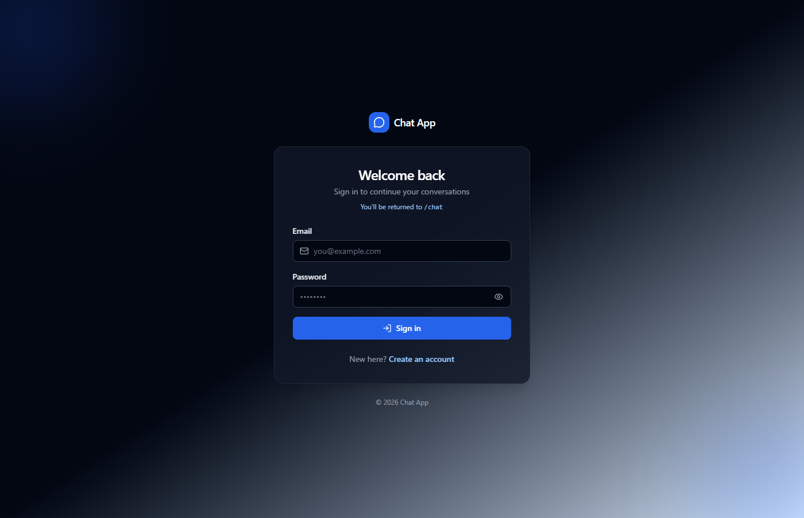
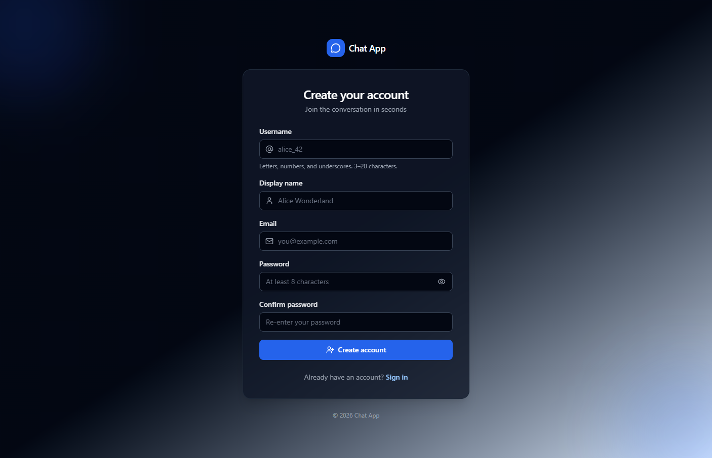
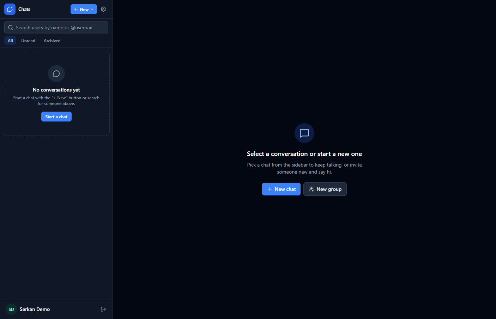
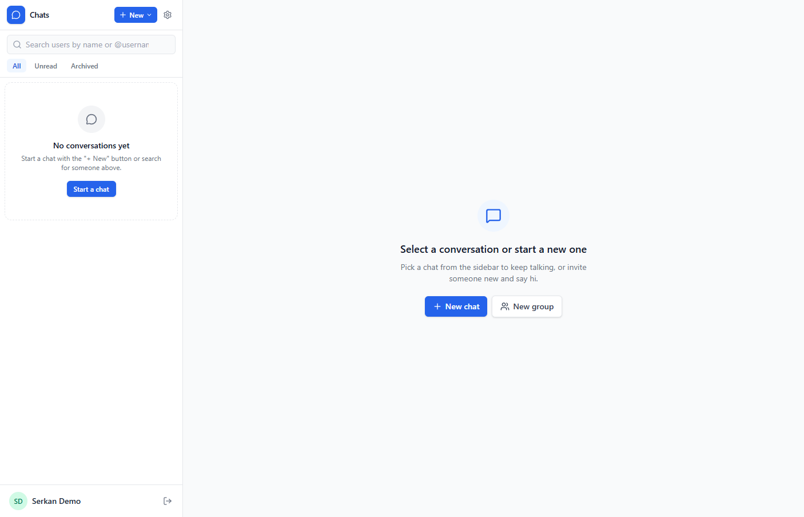
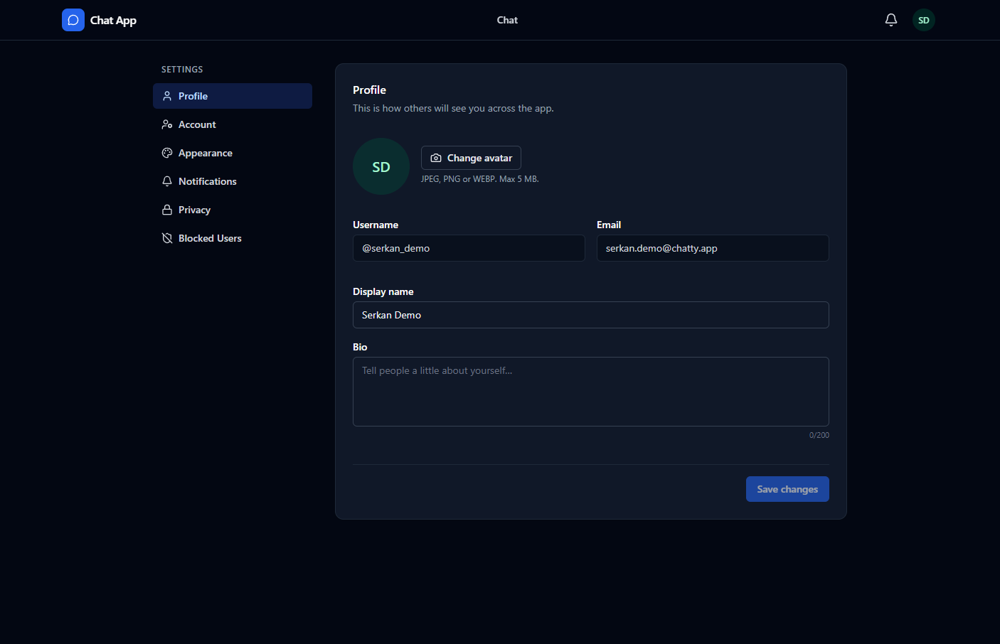
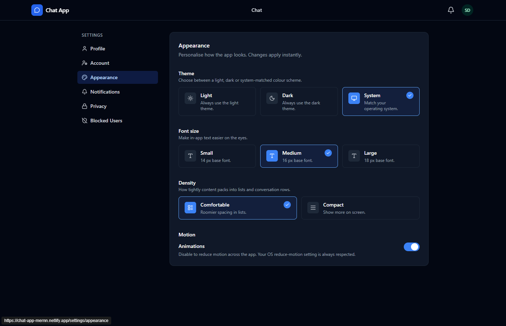

# 💬 Chat App MERN

A production-grade real-time chat platform built on the **MERN** stack (MongoDB, Express, React, Node.js) and **Socket.io**. Includes 1-1 and group messaging, presence, typing indicators, read receipts, image uploads via Cloudinary, emoji reactions, message edit/delete, browser notifications, granular privacy controls, full theming, and an admin moderation surface — all hardened with a defense-in-depth security model.

[](https://serkanbayraktar.com/)
[](https://github.com/Serkanbyx)

---

## Features

- **Real-time Messaging** — Direct (1-1) and group conversations powered by Socket.io with sub-second delivery.
- **Presence System** — Online/offline indicator with a per-user privacy toggle to opt out of broadcasting status.
- **Typing Indicators** — Auto-expire after 5 seconds and clear automatically on disconnect or focus loss.
- **Read Receipts** — Single ✓ for delivered, double ✓✓ for read; receiver-side privacy toggle to disable broadcasts.
- **Browser Notifications & Sound** — Suppressed for the active conversation and muted threads; user-configurable.
- **Image Messages** — Cloudinary upload pipeline with MIME whitelist (`jpeg/png/webp`) and a 5 MB cap.
- **Emoji Reactions** — Single-click toggle, deduplicated server-side per `(user, emoji, message)` tuple.
- **Message Edit & Delete** — Edit window 15 min, delete-for-everyone window 5 min; both enforced server-side.
- **User Search, Block, Mute & Archive** — Granular per-conversation and per-user controls.
- **Group Chats** — Admin roles, rename, member add/remove, last-admin protection, audit-logged.
- **Reporting & Admin Moderation** — Report queue, force-delete, audit log, force-disconnect on suspend.
- **Themes & Accessibility** — Light/dark themes, font size, density, and reduced-motion preferences.
- **Production-Grade Security** — Helmet, rate limiting, CORS whitelist, sanitization, ReDoS-safe regex, JWT.

---

## Live Demo

- **Frontend:** [https://chat-app-mernn.netlify.app/](https://chat-app-mernn.netlify.app/)
- **Backend API:** [https://chat-app-mern-dm8x.onrender.com/](https://chat-app-mern-dm8x.onrender.com/)
- **API Documentation (Swagger UI):** [https://chat-app-mern-dm8x.onrender.com/api-docs](https://chat-app-mern-dm8x.onrender.com/api-docs)
- **Health Check:** [https://chat-app-mern-dm8x.onrender.com/api/health](https://chat-app-mern-dm8x.onrender.com/api/health)

> The backend is deployed on Render and the frontend on Netlify. Cold starts on the free tier may take a few seconds.

---

## Screenshots

### Authentication

| Login Page                                  | Register Page                                  |
| ------------------------------------------- | ---------------------------------------------- |
|       |    |

### Chat Surface

| Dark Theme                                              | Light Theme                                              |
| ------------------------------------------------------- | -------------------------------------------------------- |
|      |     |

### Settings

| Profile Settings                                                | Appearance Settings                                                       |
| --------------------------------------------------------------- | ------------------------------------------------------------------------- |
|     |         |

---

## Technologies

### Frontend

- **React 19**: Modern UI library with hooks and the Context API for state management.
- **Vite 8**: Lightning-fast build tool and dev server with HMR.
- **React Router 7**: Declarative client-side routing with nested layouts and route guards.
- **Tailwind CSS 4**: Utility-first CSS framework with the new Vite plugin and design tokens.
- **Socket.io Client 4**: WebSocket client with auto-reconnect and JWT handshake.
- **Axios 1**: Promise-based HTTP client with request/response interceptors.
- **React Hot Toast**: Lightweight, accessible toast notifications.
- **Lucide React**: Consistent, tree-shakable icon set.
- **Emoji Picker React**: Keyboard-accessible emoji picker for the composer.
- **clsx**: Tiny utility for conditional className composition.

### Backend

- **Node.js 18+**: Server-side JavaScript runtime (ESM).
- **Express 5**: Minimal, modern web framework with native async error handling.
- **MongoDB (Mongoose 9)**: NoSQL database with elegant ODM and schema validation.
- **Socket.io 4**: Real-time bidirectional event-based communication on a shared HTTP server.
- **JSON Web Token**: Stateless authentication via `Authorization: Bearer` header.
- **bcryptjs**: Password hashing with cost factor 12.
- **Cloudinary**: Server-mediated image uploads and CDN delivery.
- **Multer**: `multipart/form-data` parser using memory storage for streamed uploads.
- **Helmet**: Secure HTTP headers (HSTS, CSP-friendly defaults, X-Frame-Options, …).
- **express-rate-limit**: Per-route buckets (auth, message, upload, admin, global).
- **express-validator**: Input validation and sanitization chains on every route.
- **express-mongo-sanitize**: NoSQL injection guard, paired with a custom Express 5–safe middleware.
- **compression**: Gzip response compression for HTTP responses.
- **morgan**: HTTP request logger for development observability.
- **dotenv**: Environment variable loader with startup validation.

---

## Installation

### Prerequisites

- **Node.js** v18.18+ and **npm**
- **MongoDB** — [MongoDB Atlas](https://www.mongodb.com/atlas) (free tier) or a local instance
- **Cloudinary** account — free tier is sufficient

### Local Development

**1. Clone the repository:**

```bash
git clone https://github.com/Serkanbyx/chat-app-mern.git
cd chat-app-mern
```

**2. Set up environment variables:**

```bash
cp server/.env.example server/.env
cp client/.env.example client/.env
```

**server/.env**

```env
NODE_ENV=development
PORT=5000
CLIENT_URL=http://localhost:5173

MONGO_URI=your_mongodb_connection_string
JWT_SECRET=your_long_random_secret_min_32_chars
JWT_EXPIRES_IN=7d

CLOUDINARY_CLOUD_NAME=your_cloud_name
CLOUDINARY_API_KEY=your_api_key
CLOUDINARY_API_SECRET=your_api_secret

ADMIN_EMAIL=admin@example.com
ADMIN_USERNAME=admin
ADMIN_PASSWORD=your_strong_admin_password

MAX_UPLOAD_SIZE_MB=5
```

**client/.env**

```env
VITE_API_URL=http://localhost:5000/api
VITE_SOCKET_URL=http://localhost:5000
```

**3. Install dependencies:**

```bash
cd server && npm install
cd ../client && npm install
```

**4. Seed the initial admin (idempotent):**

```bash
cd ../server
npm run seed:admin
```

**5. Run the application:**

```bash
# Terminal 1 — Backend
cd server && npm run dev

# Terminal 2 — Frontend
cd client && npm run dev
```

Open [http://localhost:5173](http://localhost:5173) in your browser. The interactive **API documentation** is available at [http://localhost:5000/api-docs](http://localhost:5000/api-docs) and the health probe at [http://localhost:5000/api/health](http://localhost:5000/api/health).

> Generate a strong `JWT_SECRET` with: `node -e "console.log(require('crypto').randomBytes(32).toString('hex'))"`

---

## Usage

1. **Register** a new account with a unique username, email, and a strong password.
2. **Log in** with your credentials — a JWT is stored in `localStorage` and attached to every request.
3. **Search** for users in the sidebar to start a new direct conversation.
4. **Create a group** from the new-chat modal, add members, and assign admin roles.
5. **Send messages** — text up to 4000 chars, image attachments up to 5 MB, replies, and reactions.
6. **Edit** your own message within 15 minutes; **delete for everyone** within 5 minutes.
7. **React** with emojis, **mute** noisy conversations, **archive** completed ones.
8. **Block** unwanted users from your privacy settings.
9. **Customize** your appearance: theme, font size, density, reduced motion.
10. **Admin users** can visit `/admin` to access the moderation dashboard, manage users, resolve reports, and audit conversations.

---

## How It Works?

### Authentication Flow

1. The client posts credentials to `/api/auth/register` or `/api/auth/login`.
2. The server validates input, checks the bcrypt hash, and signs a JWT with the user's `id` and `role`.
3. The client stores the JWT in `localStorage` and the Axios interceptor attaches it as `Authorization: Bearer <token>` on every request.
4. The Express `protect` middleware verifies the JWT and **re-fetches the user from the database** on every request — suspended users are blocked instantly.
5. The same `socketAuthMiddleware` runs on the Socket.io handshake so HTTP and WebSocket share a single auth identity.

```javascript
api.interceptors.request.use((config) => {
  const token = localStorage.getItem('token');
  if (token) config.headers.Authorization = `Bearer ${token}`;
  return config;
});
```

### Real-time Architecture

- The Express API and the Socket.io server share **one HTTP server, one port, one CORS policy** — a single source of truth for origin, credentials, and auth.
- The server is the **single source of truth for socket room membership**. `socket.join` / `socket.leave` are never invoked from client input; every join is the result of a DB-verified participant lookup.
- Each user has a personal room `user:<id>` for direct fan-out (notifications, group invitations, force-disconnect).
- Each conversation has a room `conv:<id>` joined only by verified participants.

### Why HTTP + WebSocket?

HTTP is request/response and stateless: clients must poll to discover new data. WebSocket establishes a single long-lived TCP connection upgraded from HTTP, enabling the server to push events with low latency. This project uses **HTTP** for naturally request/response operations (auth, listing conversations, history pagination, uploads, admin) and **WebSocket** for events that benefit from server-push (new messages, presence, typing, read receipts, group changes, notifications).

### Image Upload Pipeline

1. The client posts the file to `/api/upload/message-image` as `multipart/form-data`.
2. Multer streams it into memory; the upload middleware enforces MIME whitelist and 5 MB cap.
3. The server uploads to Cloudinary with a server-generated `publicId`.
4. The canonical Cloudinary URL is returned and used in the next `message:send` event.
5. Message bodies only accept image URLs whose host matches the configured Cloudinary CDN — preventing arbitrary external embeds.

### Defense-in-depth Middleware Stack

```javascript
app.use(helmet());
app.use(compression());
app.use(cors({ origin: env.CLIENT_URL, credentials: true, methods: [...] }));
app.use(express.json({ limit: '100kb' }));
app.use(sanitizeRequest);
app.use('/api', globalLimiter);
app.use('/api/auth', authLimiter, authRoutes);
app.use('/api/admin', protect, adminOnly, adminLimiter, adminRoutes);
```

---

## API Endpoints

> Base URL: `${VITE_API_URL}` (e.g. `http://localhost:5000/api` in development). All authenticated routes require an `Authorization: Bearer <jwt>` header.
>
> 📖 Full interactive **OpenAPI / Swagger** documentation is available at `/api-docs` (e.g. [http://localhost:5000/api-docs](http://localhost:5000/api-docs)) and the raw spec at `/api-docs.json`.

### Health

| Method | Endpoint      | Auth | Description                |
| ------ | ------------- | ---- | -------------------------- |
| GET    | `/api/health` | No   | Liveness probe             |

### Auth

| Method | Endpoint             | Auth | Description                                       |
| ------ | -------------------- | ---- | ------------------------------------------------- |
| POST   | `/api/auth/register` | No   | Create a new user (rate-limited)                  |
| POST   | `/api/auth/login`    | No   | Issue a JWT (rate-limited)                        |
| GET    | `/api/auth/me`       | Yes  | Current user profile and preferences              |
| PATCH  | `/api/auth/profile`  | Yes  | Update `displayName`, `bio`, `avatarUrl`          |
| PATCH  | `/api/auth/password` | Yes  | Change password (requires current password)       |
| DELETE | `/api/auth/account`  | Yes  | Anonymize messages and remove from conversations  |

### Users

| Method | Endpoint                  | Auth | Description                                |
| ------ | ------------------------- | ---- | ------------------------------------------ |
| GET    | `/api/users/search?q=`    | Yes  | Username/displayName prefix search         |
| GET    | `/api/users/me/blocked`   | Yes  | List of users you have blocked             |
| PATCH  | `/api/users/me/preferences` | Yes | Theme, density, privacy, notifications     |
| POST   | `/api/users/:userId/block` | Yes | Block a user                               |
| DELETE | `/api/users/:userId/block` | Yes | Unblock a user                             |
| GET    | `/api/users/:username`    | Yes  | Public profile by username                 |

### Conversations

| Method | Endpoint                                | Auth | Description                                  |
| ------ | --------------------------------------- | ---- | -------------------------------------------- |
| GET    | `/api/conversations`                    | Yes  | Paginated list (`page`, `limit`, `archived`) |
| GET    | `/api/conversations/unread-summary`     | Yes  | Per-conversation unread counts               |
| POST   | `/api/conversations/direct`             | Yes  | Find-or-create a 1-1 conversation            |
| POST   | `/api/conversations/group`              | Yes  | Create a new group                           |
| GET    | `/api/conversations/:id`                | Yes  | Conversation detail                          |
| PATCH  | `/api/conversations/:id`                | Yes  | Rename / change avatar (group admin)         |
| DELETE | `/api/conversations/:id`                | Yes  | Leave / delete a conversation                |
| POST   | `/api/conversations/:id/members`        | Yes  | Add members (group admin)                    |
| DELETE | `/api/conversations/:id/members/:userId` | Yes | Remove a member (group admin)                |
| POST   | `/api/conversations/:id/admins/:userId` | Yes  | Promote to admin (group admin)               |
| DELETE | `/api/conversations/:id/admins/:userId` | Yes  | Demote admin (last-admin protected)          |
| POST   | `/api/conversations/:id/mute`           | Yes  | Toggle mute for the current user             |
| POST   | `/api/conversations/:id/archive`        | Yes  | Toggle archive for the current user          |
| POST   | `/api/conversations/:id/read`           | Yes  | Mark conversation as read up to latest       |

### Messages

| Method | Endpoint                                          | Auth | Description                                    |
| ------ | ------------------------------------------------- | ---- | ---------------------------------------------- |
| GET    | `/api/conversations/:id/messages`                 | Yes  | Cursor pagination via `?before=<msgId>`        |
| POST   | `/api/conversations/:id/messages`                 | Yes  | Send a message (rate-limited)                  |
| GET    | `/api/conversations/:id/messages/search?q=`       | Yes  | Full-text search inside a conversation         |
| PATCH  | `/api/messages/:id`                               | Yes  | Edit own message (≤ 15 min)                    |
| DELETE | `/api/messages/:id`                               | Yes  | Delete `for-me` (any time) / `everyone` (≤ 5 min) |
| POST   | `/api/messages/:id/reactions`                     | Yes  | Toggle a reaction with `{ emoji }`             |

### Uploads

| Method | Endpoint                    | Auth | Description                                      |
| ------ | --------------------------- | ---- | ------------------------------------------------ |
| POST   | `/api/upload/avatar`        | Yes  | `multipart/form-data` field `file` (≤ 5 MB)      |
| POST   | `/api/upload/message-image` | Yes  | Same constraints; returns the Cloudinary URL     |

### Notifications

| Method | Endpoint                            | Auth | Description                              |
| ------ | ----------------------------------- | ---- | ---------------------------------------- |
| GET    | `/api/notifications`                | Yes  | Paginated notification list              |
| GET    | `/api/notifications/unread-count`   | Yes  | Number badge for the bell icon           |
| PATCH  | `/api/notifications/read-all`       | Yes  | Mark every notification as read          |
| PATCH  | `/api/notifications/:id/read`       | Yes  | Mark a single notification as read       |
| DELETE | `/api/notifications/:id`            | Yes  | Dismiss a notification                   |

### Reports

| Method | Endpoint           | Auth | Description                                 |
| ------ | ------------------ | ---- | ------------------------------------------- |
| POST   | `/api/reports`     | Yes  | File a report (target: user/message/conv)   |

### Admin (`role: admin`)

| Method | Endpoint                                       | Auth  | Description                                  |
| ------ | ---------------------------------------------- | ----- | -------------------------------------------- |
| GET    | `/api/admin/stats`                             | Admin | Counts: users, online, conversations, …      |
| GET    | `/api/admin/users`                             | Admin | List/search users with filters               |
| GET    | `/api/admin/users/:id`                         | Admin | User detail with related counts              |
| PATCH  | `/api/admin/users/:id/status`                  | Admin | `active` / `suspended` (audit-logged)        |
| PATCH  | `/api/admin/users/:id/role`                    | Admin | `user` / `admin` (last-admin protected)      |
| DELETE | `/api/admin/users/:id`                         | Admin | Hard-delete with cascade cleanup             |
| GET    | `/api/admin/reports`                           | Admin | Moderation queue with filters                |
| GET    | `/api/admin/reports/:id`                       | Admin | Report detail with target preview            |
| PATCH  | `/api/admin/reports/:id`                       | Admin | Resolve / dismiss with `reviewNote`          |
| DELETE | `/api/admin/messages/:id`                      | Admin | Force-delete; emits `message:deleted`        |
| GET    | `/api/admin/conversations/:id/messages`        | Admin | Audit window into any conversation (logged)  |

> Auth endpoints require `Authorization: Bearer <token>` header. Admin endpoints additionally require the user role to be `admin` and pass through a stricter `adminLimiter`.

### Socket.io Events

**Client → Server**

| Event                | Payload                                                       | Description                          |
| -------------------- | ------------------------------------------------------------- | ------------------------------------ |
| `message:send`       | `{ conversationId, type, text?, imageUrl?, replyTo? }`        | Persist and broadcast a new message  |
| `message:edit`       | `{ messageId, text }`                                         | ≤ 15 min, sender only                |
| `message:delete`     | `{ messageId, scope: 'me' \| 'everyone' }`                    | `everyone` ≤ 5 min, sender only      |
| `message:reaction`   | `{ messageId, emoji }`                                        | Toggle the user's reaction           |
| `conversation:read`  | `{ conversationId, lastReadMessageId? }`                      | Update per-user `lastRead`           |
| `conversation:open`  | `{ conversationId }`                                          | Suppress notifications for thread    |
| `conversation:close` | `{ conversationId }`                                          | Re-enable notifications for thread   |
| `typing:start`       | `{ conversationId }`                                          | Broadcast to other participants      |
| `typing:stop`        | `{ conversationId }`                                          | Manual stop (auto-stop after 5 s)    |
| `presence:list`      | `{ userIds: string[] }`                                       | Snapshot lookup for the sidebar      |

**Server → Client**

| Event                     | Payload                                                              | Description                          |
| ------------------------- | -------------------------------------------------------------------- | ------------------------------------ |
| `message:new`             | `{ message }`                                                        | Fan-out to `conv:<id>` participants  |
| `message:edited`          | `{ message }`                                                        | New text and `editedAt`              |
| `message:deleted`         | `{ messageId, conversationId, scope }`                               | Redact bubble client-side            |
| `message:reactionUpdated` | `{ messageId, reactions }`                                           | Aggregated reactions per emoji       |
| `conversation:readBy`     | `{ conversationId, userId, lastReadMessageId, readAt }`              | Powers ✓✓ ticks                      |
| `userOnline` / `userOffline` | `{ userId, lastSeenAt? }`                                         | Privacy-aware presence broadcasts    |
| `typing:start` / `typing:stop` | `{ conversationId, userId }`                                    | Excludes the typing user             |
| `notification:new`        | `{ notification }`                                                   | Direct fan-out to `user:<id>`        |
| `group:created`           | `{ conversation }`                                                   | Sent to every member's personal room |
| `group:memberAdded` / `group:memberRemoved` / `group:youWereRemoved` | various                                   | Group membership lifecycle           |
| `group:updated`           | `{ conversationId, name?, avatarUrl?, updatedBy }`                   | Group metadata changed               |
| `group:adminChanged`      | `{ conversationId, userId, action, actorId }`                        | Promotion / demotion                 |
| `server:error`            | `{ message }`                                                        | Connection-time setup failure        |

---

## Project Structure

```
chat-app-mern/
├── client/                              # React 19 + Vite SPA
│   ├── public/                          # Static assets (favicon, sounds)
│   └── src/
│       ├── api/                         # Axios instance + per-resource services
│       │   ├── axios.js                 # Base instance with JWT interceptor
│       │   ├── auth.service.js
│       │   ├── user.service.js
│       │   ├── conversation.service.js
│       │   ├── message.service.js
│       │   ├── notification.service.js
│       │   ├── upload.service.js
│       │   └── admin.service.js
│       ├── components/
│       │   ├── admin/                   # Stats cards, user/report rows
│       │   ├── chat/                    # Composer, list, bubbles, modals
│       │   ├── common/                  # Reusable UI primitives + skeletons
│       │   ├── guards/                  # Route guards (auth, admin, guest)
│       │   ├── layout/                  # Sidebar, navbar, dropdowns
│       │   └── modals/                  # Confirm, report, block modals
│       ├── contexts/                    # Auth, Socket, ChatState, Preferences, Notifications
│       ├── hooks/                       # useDebounce, useInfiniteScroll, useScrollToBottom, …
│       ├── layouts/                     # Auth, Main, Chat, Settings, Admin shells
│       ├── pages/                       # Route components (auth, chat, admin, settings, …)
│       ├── utils/                       # formatDate, helpers, notify, sound, constants
│       ├── App.jsx                      # Router + provider tree
│       ├── index.css                    # Tailwind v4 theme + design tokens
│       └── main.jsx                     # Entry point
│   ├── index.html
│   ├── vite.config.js
│   └── package.json
│
├── server/                              # Express 5 + Socket.io API
│   ├── config/
│   │   ├── env.js                       # Validated environment loader
│   │   ├── db.js                        # Mongoose connection
│   │   ├── socket.js                    # Socket.io bootstrap
│   │   └── cloudinary.js                # Cloudinary SDK setup
│   ├── controllers/                     # Thin HTTP handlers
│   ├── middlewares/                     # auth, role, validate, sanitize, rateLimiters, upload, error
│   ├── models/                          # User, Conversation, Message, Notification, Report, AdminAuditLog
│   ├── routes/                          # One file per resource
│   ├── scripts/
│   │   └── seedAdmin.js                 # Idempotent admin seeder
│   ├── sockets/                         # auth, presence, typing, message, group, rooms
│   ├── utils/                           # services, serializers, apiError, asyncHandler, escapeRegex
│   ├── validators/                      # express-validator chains
│   ├── index.js                         # App bootstrap (HTTP + Socket.io on one port)
│   └── package.json
│
├── docs/
│   └── screenshots/                     # README screenshots
├── render.yaml                          # Render deployment blueprint
├── .gitignore
└── README.md
```

---

## Security

- **Helmet** — Secure HTTP headers (HSTS, `X-Content-Type-Options`, `X-Frame-Options`, …) and `x-powered-by` disabled.
- **Strict CORS** — Bound to `CLIENT_URL`, explicit method allow-list, no wildcards, credentials enabled only when needed.
- **Body Limits** — `express.json({ limit: '100kb' })` and matching `urlencoded` to mitigate payload-based DoS.
- **Password Hashing** — bcrypt with cost factor 12; the `password` field is `select: false` and never serialized.
- **JWT Hardening** — `Authorization: Bearer` only (no cookies, no query strings); `JWT_SECRET` minimum length enforced at startup; default values rejected in production.
- **Anti-enumeration** — Generic `401 Invalid email or password` to defeat user enumeration during login.
- **Input Validation** — `express-validator` chains on every route, with `.escape()` on free-text fields.
- **NoSQL Injection Guard** — Custom `sanitizeRequest` middleware strips `$` / `.` from `req.body` and `req.params` (Express 5–safe; never mutates `req.query`).
- **ObjectId Validation** — Mongoose ObjectId validation on every `:id` route param to reject malformed IDs early.
- **ReDoS-safe Search** — All `$regex` searches escape user input via `escapeRegex()` to defeat catastrophic backtracking.
- **Mass-assignment Proof** — Controllers destructure only allowed fields; `role`, `status`, `email`, `password` are never settable from public routes.
- **Authorization Guards** — `assertParticipant`, `assertGroupAdmin`, `assertOwnership` checks on every mutation.
- **Re-fetch on Auth** — `protect` middleware re-fetches the user on every request so suspended users are blocked instantly.
- **Last-admin Protection** — Cannot demote/delete the only admin in a group or system-wide.
- **Admin Self-protection** — Cannot suspend/demote/delete self; cannot suspend another admin from the API.
- **Socket Hardening** — Same `socketAuthMiddleware` as HTTP; `maxHttpBufferSize: 1 MB`; `socket.join`/`leave` only from server logic; suspending a user immediately calls `io.to('user:<id>').disconnectSockets(true)`.
- **Rate Limiting** — Separate buckets: `globalLimiter`, `authLimiter`, `messageLimiter`, `uploadLimiter`, `adminLimiter`.
- **Upload Validation** — MIME whitelist (`image/jpeg | png | webp`), 5 MB cap, `multer.memoryStorage`, server-generated Cloudinary `publicId`, message URL host match against the configured CDN.
- **Privacy Enforcement** — `showOnlineStatus` and `showReadReceipts` enforced **server-side** in presence and read events.
- **Audit Logging** — Admin moderation actions persisted to a write-only `AdminAuditLog`.
- **Report Cooldown** — Same `(reporter, target)` pair blocked from re-reporting within 24 hours.
- **Production Errors** — Error handler returns `{ success, message }` only — no stack traces, no Mongoose internals, no paths.

---

## Deployment

### Backend (Render)

1. Push the repository to GitHub.
2. Create a new **Web Service** on [Render](https://render.com/) and connect the repository.
3. Set the **Root Directory** to `server`, the **Build Command** to `npm install`, and the **Start Command** to `npm start`.
4. Add the environment variables below.
5. After the first deploy, run the admin seeder once via Render's shell: `npm run seed:admin`.

| Variable                 | Value                                                       |
| ------------------------ | ----------------------------------------------------------- |
| `NODE_ENV`               | `production`                                                |
| `PORT`                   | `10000` (Render-provided)                                   |
| `CLIENT_URL`             | `https://chat-app-mernn.netlify.app`                        |
| `MONGO_URI`              | MongoDB Atlas SRV connection string                         |
| `JWT_SECRET`             | A 32+ character random secret                               |
| `JWT_EXPIRES_IN`         | `7d`                                                        |
| `CLOUDINARY_CLOUD_NAME`  | From your Cloudinary dashboard                              |
| `CLOUDINARY_API_KEY`     | From your Cloudinary dashboard                              |
| `CLOUDINARY_API_SECRET`  | From your Cloudinary dashboard                              |
| `ADMIN_EMAIL`            | Initial admin email                                         |
| `ADMIN_USERNAME`         | Initial admin username                                      |
| `ADMIN_PASSWORD`         | Strong initial admin password                               |
| `MAX_UPLOAD_SIZE_MB`     | `5`                                                         |

> A ready-to-use `render.yaml` blueprint is included at the project root.

### Frontend (Netlify)

1. Push the repository to GitHub.
2. Create a new site on [Netlify](https://www.netlify.com/) and link the repository.
3. Set the **Base Directory** to `client`, the **Build Command** to `npm run build`, and the **Publish Directory** to `client/dist`.
4. Add the environment variables below.
5. Enable SPA fallback by adding `_redirects` or a `netlify.toml` rule that maps `/*` to `/index.html` with a `200` status.

| Variable          | Value                                              |
| ----------------- | -------------------------------------------------- |
| `VITE_API_URL`    | `https://<your-render-service>.onrender.com/api`   |
| `VITE_SOCKET_URL` | `https://<your-render-service>.onrender.com`       |

> WebSocket support is enabled on Render's web services by default. After deployment, verify the live site at [https://chat-app-mernn.netlify.app/](https://chat-app-mernn.netlify.app/) and the API health probe at `https://<your-render-service>.onrender.com/api/health`.

---

## Features in Detail

### Completed Features

- ✅ JWT authentication with bcrypt password hashing
- ✅ Real-time 1-1 and group messaging over Socket.io
- ✅ Presence, typing indicators, read receipts
- ✅ Image uploads via Cloudinary with MIME and size validation
- ✅ Emoji reactions with deduplication
- ✅ Message edit (15 min) and delete (5 min for everyone)
- ✅ Browser notifications and in-app sound with mute/active-thread suppression
- ✅ User search, block, mute, archive
- ✅ Group admin roles, member management, last-admin protection
- ✅ Reporting and admin moderation surface with audit log
- ✅ Light/dark themes, font size, density, reduced motion
- ✅ Defense-in-depth security audit (Helmet, rate limiting, sanitization, ReDoS guard)
- ✅ Production deployment to Render + Netlify

### Future Features

- [ ] Voice and video calls (WebRTC)
- [ ] Voice messages
- [ ] End-to-end encryption for direct conversations
- [ ] File attachments beyond images (PDF, audio, video)
- [ ] Message forwarding and pinning
- [ ] Internationalization (i18n) for multiple languages
- [ ] Push notifications via Web Push / FCM

---

## Contributing

1. **Fork** the repository.
2. **Create a feature branch**: `git checkout -b feat/your-feature`.
3. **Commit your changes** with a descriptive message (see format below).
4. **Push to your fork**: `git push origin feat/your-feature`.
5. **Open a Pull Request** describing the change and any breaking implications.

| Prefix      | Description                         |
| ----------- | ----------------------------------- |
| `feat:`     | New feature                         |
| `fix:`      | Bug fix                             |
| `refactor:` | Code refactoring                    |
| `docs:`     | Documentation changes               |
| `chore:`    | Maintenance and dependency updates  |

---

## License

Released under the [MIT License](./LICENSE).

---

## Developer

**Serkan Bayraktar**

- 🌐 Website: [serkanbayraktar.com](https://serkanbayraktar.com/)
- 💻 GitHub: [@Serkanbyx](https://github.com/Serkanbyx)
- 📧 Email: [serkanbyx1@gmail.com](mailto:serkanbyx1@gmail.com)

---

## Acknowledgments

- [React](https://react.dev/) — UI library
- [Vite](https://vitejs.dev/) — Build tool and dev server
- [Tailwind CSS](https://tailwindcss.com/) — Utility-first CSS framework
- [Express](https://expressjs.com/) — Web framework
- [MongoDB](https://www.mongodb.com/) and [Mongoose](https://mongoosejs.com/) — Database and ODM
- [Socket.io](https://socket.io/) — Real-time engine
- [Cloudinary](https://cloudinary.com/) — Image storage and CDN
- [Lucide](https://lucide.dev/) — Icon set
- [React Hot Toast](https://react-hot-toast.com/) — Toast notifications
- [Render](https://render.com/) and [Netlify](https://www.netlify.com/) — Hosting platforms

---

## Contact

- 🐛 **Issues**: [Open an issue](https://github.com/Serkanbyx/chat-app-mern/issues)
- 📧 **Email**: [serkanbyx1@gmail.com](mailto:serkanbyx1@gmail.com)
- 🌐 **Website**: [serkanbayraktar.com](https://serkanbayraktar.com/)

---

⭐ If you like this project, don't forget to give it a star!
