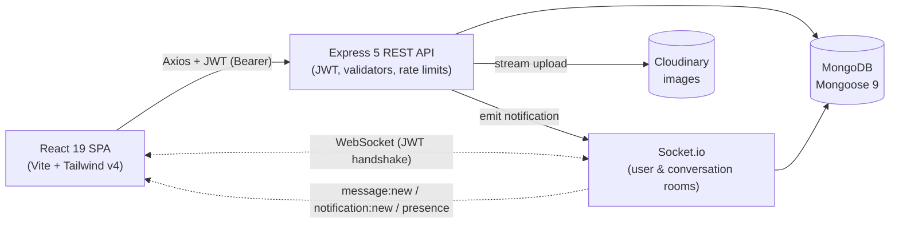

# Chat App MERN — Step-by-Step Build Guide

> **Archived: original build playbook.** This guide is the original roadmap used to build Chat App MERN — a real-time messaging platform on the MERN stack with Socket.io. It is preserved as a making-of narrative; the codebase may have evolved since the guide was written (new validators, security hardening, and bug fixes have landed). For the current setup, architecture, and deployment notes, see [../README.md](../README.md).

---

> **Project Summary:** Chat App MERN is a full-stack real-time chat application. Users register and authenticate with JWT, then exchange direct (1-1) and group messages in real time over Socket.io. Core features include presence, typing indicators, read receipts, image uploads (Cloudinary), emoji reactions, message edit/delete with time windows, replies, browser notifications with sound, user search/block/mute/archive, and granular per-user privacy controls. A dedicated admin role unlocks a moderation surface: user management, a report queue, force-delete, audit logging, and force-disconnect on suspension. Security is layered defense-in-depth: Helmet, strict CORS, per-route rate limiting, input validation and sanitization, NoSQL-injection and ReDoS guards, server-side authorization, and privacy enforcement on every socket event.

Each step below is a self-contained prompt. Execute them in order.

Stack: React 19, Vite 8, Tailwind CSS 4, React Router 7, Axios, Socket.io Client 4, Node.js 18+, Express 5, MongoDB (Mongoose 9), Socket.io 4, JWT, bcryptjs, Cloudinary, Multer, Helmet, express-validator, express-rate-limit.

---

## Table of Contents

**PHASE 1 — Backend Foundation**

- STEP 1 — Project Scaffolding & Dependency Setup
- STEP 2 — Environment Validation & Database Connection
- STEP 3 — Core Models (User, Conversation, Message)
- STEP 4 — Auth Utilities, Middleware & Error Handling
- STEP 5 — Security Middleware Stack

**PHASE 2 — Backend Resources**

- STEP 6 — Authentication Routes & Controllers
- STEP 7 — Users, Privacy & Blocking
- STEP 8 — Conversations (Direct & Group)
- STEP 9 — Messages (Send, Edit, Delete, React, Search)
- STEP 10 — Uploads, Notifications & Reports
- STEP 11 — Admin Moderation & Audit Log
- STEP 12 — Real-time Layer (Socket.io)
- STEP 13 — OpenAPI / Swagger Documentation

**PHASE 3 — Client Foundation**

- STEP 14 — Client Scaffolding & API Layer
- STEP 15 — Context Providers & Routing Shell
- STEP 16 — Shared Hooks & UI Primitives

**PHASE 4 — Client Pages**

- STEP 17 — Auth Pages & Route Guards
- STEP 18 — Chat Surface (List, Bubbles, Composer)
- STEP 19 — Settings & Profile
- STEP 20 — Notifications & Admin Dashboard

**PHASE 5 — Polish & Deploy**

- STEP 21 — Theming, Accessibility & Performance
- STEP 22 — Deployment (Render + Netlify)

**Appendices**

- Appendix A — Shared Constants & Time Windows
- Appendix B — Reusable Patterns
- Appendix C — Common Pitfalls
- Appendix D — Pre-flight Checklist

---

## Global Build Rules (apply to EVERY step)

- **No git operations.** Do not run any `git` command (no `add`, `commit`, `push`, `branch`, `merge`, `rebase`). Version control is handled manually by the user.
- **No unapproved packages.** Only install dependencies listed in a step. Prefer native methods over new dependencies.
- **No long-running processes** (dev servers, watchers, seeders) unless the step explicitly requests it.
- **Treat every step as self-contained.** Re-read the relevant files before editing; do not assume prior in-memory state.
- **Server is the source of truth.** Authorization, privacy, room membership, and time windows are enforced on the server, never trusted from the client.
- **Modern, clean code.** ES6+ modules, async/await, React Hooks. Descriptive English identifiers in camelCase. Keep it DRY, reusable, and testable.
- **Security, performance, and accessibility (a11y) are first-class** in every step.

---

## Architecture at a Glance

A single Express HTTP server hosts both the REST API and the Socket.io server, sharing one port, one CORS policy, and one auth identity. The React SPA talks to REST for request/response operations and to WebSocket for server-pushed events.

---

# PHASE 1 — BACKEND FOUNDATION

---

## STEP 1 — Project Scaffolding & Dependency Setup

**Goal:** Create the monorepo layout with isolated `server/` and `client/` packages and install backend dependencies.

**Files/folders to create:**

- `server/` with `package.json` (`type: module`, scripts: `dev`, `start`, `seed:admin`)
- `server/index.js` placeholder
- `.gitignore` (node_modules, `.env`, `dist`, logs)

**Dependencies (server):** `express`, `mongoose`, `socket.io`, `jsonwebtoken`, `bcryptjs`, `cloudinary`, `multer`, `streamifier`, `helmet`, `cors`, `compression`, `morgan`, `express-validator`, `express-rate-limit`, `express-mongo-sanitize`, `dotenv`, `swagger-jsdoc`, `swagger-ui-express`. Dev: `nodemon`, `eslint`.

**Implementation notes:**

- Use ESM (`import`/`export`) throughout; set `"type": "module"`.
- Pin Node engine to `>=18.18.0`.

**Acceptance:** `npm run dev` boots a placeholder Express app on `PORT` and logs the listening port.

---

## STEP 2 — Environment Validation & Database Connection

**Goal:** Fail fast on misconfiguration and connect to MongoDB.

**Files to create:** `server/config/env.js`, `server/config/db.js`.

**Implementation notes:**

- `env.js` loads `dotenv`, reads every required variable (`MONGO_URI`, `JWT_SECRET`, `CLIENT_URL`, Cloudinary keys, admin seed vars, `MAX_UPLOAD_SIZE_MB`), and throws on missing values.
- Enforce `JWT_SECRET` minimum length (>= 32 chars) and reject known default/placeholder values when `NODE_ENV === 'production'`.
- `db.js` connects via Mongoose with sensible options and logs success/failure; export an async `connectDB()`.

**Acceptance:** App refuses to start with a clear message if any required env var is missing or weak.

---

## STEP 3 — Core Models (User, Conversation, Message)

**Goal:** Define the data layer with validation, hooks, and indexes.

**Files to create:** `server/models/User.js`, `server/models/Conversation.js`, `server/models/Message.js`, `server/utils/constants.js`.

**Implementation notes:**

- **User:** `username`, `email` (unique, lowercased), `password` (`select: false`, bcrypt hashed in a `pre('save')` hook with cost 12), `displayName`, `avatarUrl`, `bio`, `role` (`user` | `admin`), `status` (`active` | `suspended`), `blockedUsers[]`, `mutedConversations[]`, `archivedConversations[]`, and a `preferences` sub-document (theme, density, fontSize, reducedMotion, `showOnlineStatus`, `showReadReceipts`, notification toggles).
- **Conversation:** `type` (`direct` | `group`), `participants[]`, `admins[]`, `name`, `avatarUrl`, `lastMessage` snapshot, `directKey` (sorted participant ids for direct chats) with a **partial unique index** to prevent duplicate direct chats. Compute `directKey` in `pre('save')`.
- **Message:** `conversation`, `sender`, `type` (`text` | `image`), `text`, `imageUrl`, `replyTo`, `reactions[]` (`{ user, emoji }`), `readBy[]`, `editedAt`, `deletedFor[]` (per-user), `deletedForEveryone`. Index `{ conversation: 1, createdAt: -1 }` for cursor pagination.
- Centralize limits in `constants.js` (max text length, edit/delete windows, upload size).

**Acceptance:** Models compile; indexes build; bcrypt hashing verified on create.

---

## STEP 4 — Auth Utilities, Middleware & Error Handling

**Goal:** JWT issuance, request protection, and a single error funnel.

**Files to create:** `server/utils/generateToken.js`, `server/utils/apiError.js`, `server/utils/asyncHandler.js`, `server/middlewares/auth.middleware.js`, `server/middlewares/role.middleware.js`, `server/middlewares/error.middleware.js`.

**Implementation notes:**

- `generateToken` signs `{ id, role }` with `JWT_EXPIRES_IN`.
- `protect` verifies the JWT and **re-fetches the user on every request**; reject suspended users with `403`.
- `adminOnly` (role middleware) guards admin routes.
- `asyncHandler` wraps controllers; `ApiError` carries `statusCode` + message.
- The error middleware returns `{ success: false, message }` only — no stack traces or Mongoose internals in production.

**Acceptance:** A protected route returns `401` without a token, `403` for suspended users, and `200` with a valid token.

---

## STEP 5 — Security Middleware Stack

**Goal:** Defense-in-depth before any route runs.

**Files to create:** `server/middlewares/sanitize.middleware.js`, `server/middlewares/rateLimiters.js`, `server/middlewares/validate.middleware.js`, `server/utils/escapeRegex.js`, `server/validators/common.validator.js`.

**Implementation notes:**

- `sanitizeRequest`: an Express 5–safe NoSQL guard that strips `$`/`.` keys from `req.body` and `req.params` without mutating the read-only `req.query`.
- `rateLimiters`: separate buckets — `globalLimiter`, `authLimiter`, `messageLimiter`, `uploadLimiter`, `adminLimiter`.
- `validate.middleware`: runs `express-validator` chains and returns `422` with field errors.
- `escapeRegex`: escape user input before any `$regex` to defeat ReDoS.
- `common.validator`: reusable `isObjectId` param checks.
- Compose the app: `helmet()` → `compression()` → `cors({ origin: CLIENT_URL, credentials: true })` → `express.json({ limit: '100kb' })` → `sanitizeRequest` → `globalLimiter`.

**Acceptance:** Malformed `:id`, oversized bodies, and injection payloads are rejected early.

---

# PHASE 2 — BACKEND RESOURCES

---

## STEP 6 — Authentication Routes & Controllers

**Goal:** Register, login, profile, password, and account deletion.

**Files to create:** `server/routes/auth.routes.js`, `server/controllers/auth.controller.js`, `server/validators/auth.validator.js`, `server/scripts/seedAdmin.js`.

**Implementation notes:**

- `POST /register`, `POST /login` (under `authLimiter`), `GET /me`, `PATCH /profile`, `PATCH /password`, `DELETE /account`.
- Login returns a generic `401 Invalid email or password` to prevent enumeration.
- Account deletion cascades: anonymize/remove the user from conversations while preserving group invariants (see Appendix B).
- `seedAdmin.js` idempotently creates the initial admin from env vars.

**Acceptance:** Full auth lifecycle works; `npm run seed:admin` is safe to run repeatedly.

---

## STEP 7 — Users, Privacy & Blocking

**Goal:** User discovery, preferences, and blocking.

**Files to create:** `server/routes/user.routes.js`, `server/controllers/user.controller.js`, `server/validators/user.validator.js`.

**Implementation notes:**

- `GET /users/search?q=` prefix search (ReDoS-safe), `GET /users/:username` public profile, `GET /users/me/blocked`, `PATCH /users/me/preferences`, `POST`/`DELETE /users/:userId/block`.
- Blocking is enforced server-side downstream (presence, messaging, search) — not only in the UI.

**Acceptance:** Blocking a user hides their presence and prevents new direct messages from surfacing.

---

## STEP 8 — Conversations (Direct & Group)

**Goal:** Conversation lifecycle and per-user state.

**Files to create:** `server/routes/conversation.routes.js`, `server/controllers/conversation.controller.js`, `server/validators/conversation.validator.js`, `server/utils/conversationService.js`, `server/utils/pagination.js`.

**Implementation notes:**

- Endpoints: list (with `archived` filter), `unread-summary`, find-or-create `direct`, create `group`, detail, rename/avatar, leave/delete, member add/remove, admin promote/demote, mute, archive, read.
- `findOrCreateDirectConversation` relies on the `directKey` unique index and handles `11000` races gracefully.
- Toggle endpoints (`mute`, `archive`) return the **full updated array** for client reconciliation.
- `getUnreadSummary` must apply the same visibility filters as `getConversations` (exclude archived and block-hidden direct chats).
- `detachUserFromConversations` preserves group invariants (min participants, at least one admin).

**Acceptance:** No duplicate direct chats under concurrency; last-admin protection holds.

---

## STEP 9 — Messages (Send, Edit, Delete, React, Search)

**Goal:** The message domain with consistent serialization.

**Files to create:** `server/routes/message.routes.js`, `server/controllers/message.controller.js`, `server/validators/message.validator.js`, `server/utils/messageService.js`, `server/utils/serializers.js`.

**Implementation notes:**

- Define a shared `MESSAGE_POPULATE` that populates `sender` and `replyTo` (including `replyTo.sender`) on **every** path: create, list, edit, delete, react, search. A bare `replyTo` ObjectId breaks reply previews.
- Cursor pagination via `?before=<msgId>`.
- Enforce time windows server-side: edit ≤ 15 min, delete-for-everyone ≤ 5 min.
- On delete-for-everyone, refresh `Conversation.lastMessage` if the deleted message was the latest.
- Apply the direct-chat block cutoff to both `listMessages` and `searchMessages`.
- Reactions deduplicated per `(user, emoji, message)` tuple.
- Wrap REST broadcast calls (edited/deleted/reaction) in try/catch so a broadcast failure never crashes the request.

**Acceptance:** Replies render after round-trips; search respects block state; windows enforced.

---

## STEP 10 — Uploads, Notifications & Reports

**Goal:** Image pipeline, notification feed, and reporting.

**Files to create:** `server/config/cloudinary.js`, `server/middlewares/upload.middleware.js`, `server/routes/upload.routes.js`, `server/controllers/upload.controller.js`, `server/models/Notification.js`, `server/routes/notification.routes.js`, `server/controllers/notification.controller.js`, `server/utils/notificationService.js`, `server/models/Report.js`, `server/routes/report.routes.js`, `server/controllers/report.controller.js`, `server/validators/report.validator.js`, `server/utils/reportService.js`.

**Implementation notes:**

- Upload: `multer.memoryStorage`, MIME whitelist (`jpeg/png/webp`), 5 MB cap, `streamifier` to Cloudinary with a server-generated `publicId`. Return the canonical URL; message bodies only accept URLs whose host matches the Cloudinary CDN.
- Notifications: paginated list, unread-count, read/read-all, dismiss. Collapse repeated message notifications within a time window (the client must not double-count collapsed rows).
- Reports: validator field is `description` (keep the client payload aligned). Enforce a 24h cooldown per `(reporter, target)` pair.

**Acceptance:** Only valid images upload; report cooldown holds; notification badge is accurate.

---

## STEP 11 — Admin Moderation & Audit Log

**Goal:** Operator tools with an immutable audit trail.

**Files to create:** `server/routes/admin.routes.js`, `server/controllers/admin.controller.js`, `server/validators/admin.validator.js`, `server/models/AdminAuditLog.js`, `server/utils/adminAudit.js`.

**Implementation notes:**

- Stats, user list/detail, status (`active`/`suspended`), role (`user`/`admin`), hard-delete with cascade, report queue + resolve/dismiss, force-delete message, audit window into any conversation.
- Self-protection: an admin cannot suspend/demote/delete self, nor suspend another admin from the API. Last-admin protection system-wide.
- Suspending a user immediately force-disconnects their sockets (`io.to('user:<id>').disconnectSockets(true)`).
- Every moderation action writes to `AdminAuditLog`.

**Acceptance:** Suspended users drop their socket instantly; all actions are logged.

---

## STEP 12 — Real-time Layer (Socket.io)

**Goal:** Server-authoritative real-time events.

**Files to create:** `server/config/socket.js`, `server/sockets/index.js`, `server/sockets/auth.socket.js`, `server/sockets/rooms.js`, `server/sockets/onlineUsers.js`, `server/sockets/activeConversations.js`, `server/sockets/presence.socket.js`, `server/sockets/typing.socket.js`, `server/sockets/message.socket.js`, `server/sockets/group.socket.js`.

**Implementation notes:**

- Share the HTTP server and CORS policy; set `maxHttpBufferSize: 1 MB`.
- `socketAuthMiddleware` mirrors HTTP `protect` on the handshake.
- The server is the **single source of truth for room membership** — `socket.join`/`leave` only from DB-verified lookups. Personal room `user:<id>`, conversation room `conv:<id>`.
- Presence honors `showOnlineStatus`; read receipts honor `showReadReceipts`.
- Typing auto-expires after 5 s and clears on disconnect.

**Acceptance:** Messages, presence, typing, reactions, and group events fan out only to authorized rooms.

---

## STEP 13 — OpenAPI / Swagger Documentation

**Goal:** Self-documenting API.

**Files to create:** `server/config/swagger.js`; JSDoc annotations on routes.

**Implementation notes:**

- Serve Swagger UI at `/api-docs` and the raw spec at `/api-docs.json`.
- Add a `GET /api/health` liveness probe.

**Acceptance:** `/api-docs` renders all resource groups; health probe returns `200`.

---

# PHASE 3 — CLIENT FOUNDATION

---

## STEP 14 — Client Scaffolding & API Layer

**Goal:** Vite + React + Tailwind app with a typed-ish API client.

**Files to create:** `client/` (Vite React), `client/vite.config.js`, `client/src/main.jsx`, `client/src/api/axios.js`, and per-resource services in `client/src/api/` (`auth`, `user`, `conversation`, `message`, `notification`, `upload`, `admin`).

**Dependencies (client):** `react`, `react-dom`, `react-router-dom`, `axios`, `socket.io-client`, `react-hot-toast`, `lucide-react`, `emoji-picker-react`, `clsx`. Dev: `vite`, `@vitejs/plugin-react`, `tailwindcss`, `@tailwindcss/vite`, `eslint`.

**Implementation notes:**

- Axios instance reads `VITE_API_URL`; a request interceptor attaches `Authorization: Bearer <token>`; a response interceptor clears the session on `401`/`403`.
- One thin service module per backend resource.

**Acceptance:** `npm run dev` serves the app; API calls attach the JWT automatically.

---

## STEP 15 — Context Providers & Routing Shell

**Goal:** Global state and the provider/router tree.

**Files to create:** `client/src/contexts/` (`AuthContext`, `SocketContext`, `ChatStateContext`, `PreferencesContext`, `NotificationContext`), `client/src/App.jsx`, layouts in `client/src/layouts/` (`AuthLayout`, `MainLayout`, `ChatLayout`, `SettingsLayout`, `AdminLayout`).

**Implementation notes:**

- `AuthContext` bootstraps from `localStorage`, calls `/auth/me`, and treats `401`/`403` as session invalidation.
- `SocketContext` connects with the JWT handshake and exposes the socket + connection status.
- `NotificationContext` dedupes collapsed notifications and skips API calls for local-only (`local-`) ids.

**Acceptance:** Provider tree mounts; socket connects after login; refresh restores session.

---

## STEP 16 — Shared Hooks & UI Primitives

**Goal:** Reusable building blocks.

**Files to create:** `client/src/hooks/` (`useDebounce`, `useLocalStorage`, `useOnClickOutside`, `useInfiniteScroll`, `useScrollToBottom`, `useNotificationPermission`), `client/src/components/common/` (Avatar, Badge, Modal, ConfirmModal, Spinner, Tooltip, ToggleSwitch, SelectableCard, EmptyState, skeletons), `client/src/utils/` (`formatDate`, `formatRelativeTime`, `helpers`, `notify`, `notificationSound`, `constants`).

**Acceptance:** Primitives render in isolation and are accessible (focus traps in modals, ARIA labels).

---

# PHASE 4 — CLIENT PAGES

---

## STEP 17 — Auth Pages & Route Guards

**Goal:** Landing, login, register, and access control.

**Files to create:** `client/src/pages/LandingPage.jsx`, `client/src/pages/auth/LoginPage.jsx`, `client/src/pages/auth/RegisterPage.jsx`, `client/src/components/guards/` (`ProtectedRoute`, `AdminRoute`, `GuestOnlyRoute`), `client/src/pages/NotFoundPage.jsx`.

**Implementation notes:**

- Guards redirect based on auth state and role; guests-only routes bounce authenticated users to the chat.
- Forms validate inline and surface server errors via toasts.

**Acceptance:** Unauthorized access redirects correctly; admin routes require `role: admin`.

---

## STEP 18 — Chat Surface (List, Bubbles, Composer)

**Goal:** The heart of the product.

**Files to create:** `client/src/pages/chat/` (`ChatPage`, `EmptyChatPage`), `client/src/components/layout/Sidebar.jsx`, and `client/src/components/chat/` (`ConversationListItem`, `MessagesList`, `MessageBubble`, `MessageComposer`, `ReplyQuote`, `MessageStatusTicks`, `PresenceDot`, `TypingIndicator`, `UnreadBadge`, `ImageLightbox`, `SearchInChatBar`, `ChatHeader`, `NewChatModal`, `NewGroupModal`, `GroupSettingsModal`, `UserSearchInput`).

**Implementation notes:**

- Optimistic send with reconciliation on the `message:new` ack.
- Sidebar live preview mirrors the server snapshot (e.g. `[image]` for captionless images).
- Infinite scroll up for history (cursor `before`); auto-scroll to bottom on new messages when pinned.
- Read receipts via `MessageStatusTicks`; typing via `TypingIndicator`.

**Acceptance:** Real-time send/receive, edit/delete, reactions, replies, and image messages all work end-to-end.

---

## STEP 19 — Settings & Profile

**Goal:** User-facing preferences and privacy.

**Files to create:** `client/src/pages/settings/` (`ProfileSettings`, `AppearanceSettings`, `PrivacySettings`, `NotificationSettings`, `BlockedUsersSettings`, `AccountSettings`), `client/src/pages/profile/ProfilePage.jsx`, `client/src/components/modals/` (`BlockUserModal`, `ReportModal`).

**Implementation notes:**

- Privacy toggles (`showOnlineStatus`, `showReadReceipts`) persist via preferences and are enforced server-side.
- Block/report flows guard against double submission (in-flight state) and surface success/error toasts.
- `ReportModal` sends `description` (matching the server validator).

**Acceptance:** Preference changes persist and reflect immediately across sessions.

---

## STEP 20 — Notifications & Admin Dashboard

**Goal:** Notification center and operator console.

**Files to create:** `client/src/pages/notifications/NotificationsPage.jsx`, `client/src/components/layout/NotificationsDropdown.jsx`, `client/src/components/chat/NotificationPermissionBanner.jsx`, `client/src/pages/admin/` (`AdminDashboard`, `AdminUsers`, `AdminUserDetail`, `AdminReports`, `AdminMessages`), `client/src/components/admin/` (`StatsCard`, `UserRow`, `ReportRow`).

**Implementation notes:**

- Bell badge reflects the unread count without over-counting server-collapsed rows.
- Admin tables paginate and filter; destructive actions confirm via `ConfirmModal`.

**Acceptance:** Notifications mark read correctly; admins can moderate users, reports, and messages.

---

# PHASE 5 — POLISH & DEPLOY

---

## STEP 21 — Theming, Accessibility & Performance

**Goal:** Production-quality UX.

**Implementation notes:**

- Tailwind v4 design tokens for light/dark themes, font size, and density; respect `prefers-reduced-motion` and the user's reduced-motion preference.
- Keyboard navigation, focus management in modals, ARIA roles/labels, and adequate color contrast.
- Code-split routes, debounce searches, memoize heavy lists, and lazy-load the emoji picker and lightbox.

**Acceptance:** Lighthouse a11y/perf are healthy; theme and motion preferences are honored everywhere.

---

## STEP 22 — Deployment (Render + Netlify)

**Goal:** Ship it.

**Files to create:** `render.yaml`, `client/public/_redirects` (SPA fallback).

**Implementation notes:**

- **Backend (Render):** Root `server`, build `npm install`, start `npm start`. Set all env vars; run `npm run seed:admin` once post-deploy. WebSockets enabled by default.
- **Frontend (Netlify):** Base `client`, build `npm run build`, publish `client/dist`. Set `VITE_API_URL` and `VITE_SOCKET_URL`; SPA fallback maps `/*` → `/index.html` (200).

**Acceptance:** Live frontend talks to the live API over both REST and WebSocket.

---

# Appendix A — Shared Constants & Time Windows

- **Message text max:** 4000 characters.
- **Edit window:** 15 minutes (sender only).
- **Delete-for-everyone window:** 5 minutes (sender only); delete-for-me is always allowed.
- **Upload cap:** 5 MB; MIME whitelist `image/jpeg | image/png | image/webp`.
- **Typing auto-expire:** 5 seconds.
- **Report cooldown:** 24 hours per `(reporter, target)`.
- **bcrypt cost factor:** 12.
- **JSON body limit:** 100 kb. **Socket buffer:** 1 MB.

Keep these centralized (`server/utils/constants.js` and `client/src/utils/constants.js`) so the two sides never drift.

---

# Appendix B — Reusable Patterns

- **`MESSAGE_POPULATE`:** one populate definition reused by every message-returning path so `replyTo` (and its `sender`) is always hydrated.
- **`detachUserFromConversations`:** removes a user from all conversations while preserving group invariants (promote a new admin if the last admin leaves; deactivate groups that fall below the minimum participant count). Reused by self-deletion and admin hard-delete.
- **`toggleUserArrayMembership`:** flips membership in a user array field (`mutedConversations`, `archivedConversations`) and returns both the boolean and the updated list for client reconciliation.
- **`asyncHandler` + `ApiError`:** uniform async error funnel into a single error middleware.
- **`escapeRegex`:** mandatory before any `$regex` built from user input.

---

# Appendix C — Common Pitfalls

- **Bare `replyTo`:** forgetting to populate `replyTo` on one path silently breaks reply previews after a round-trip.
- **`req.query` mutation in Express 5:** `req.query` is read-only — the NoSQL sanitizer must skip it.
- **Trusting client room joins:** never `socket.join` from client input; always verify participation in the DB.
- **Stale `lastMessage`:** deleting the latest message must refresh the conversation snapshot.
- **Notification double-count:** server-collapsed notifications share an `_id`; update in place instead of incrementing.
- **403 not logging out:** suspended users get `403`, not `401` — handle both in the client interceptor and `AuthContext`.
- **Privacy enforced only in UI:** `showOnlineStatus`/`showReadReceipts` and blocking must be enforced server-side.
- **Duplicate direct chats:** rely on the `directKey` partial unique index, not just application-level checks.

---

# Appendix D — Pre-flight Checklist

- [ ] All required env vars present; `JWT_SECRET` is strong; production rejects defaults.
- [ ] Indexes build (including the `directKey` partial unique index).
- [ ] Rate limiters mounted on auth, message, upload, admin, and global scopes.
- [ ] Sanitizer, validators, and ObjectId checks active on every route.
- [ ] Socket auth mirrors HTTP auth; suspended users are force-disconnected.
- [ ] Time windows (edit/delete) enforced server-side, not just hidden in the UI.
- [ ] Privacy toggles and blocking enforced on presence, read receipts, messaging, and search.
- [ ] Client interceptor clears the session on `401`/`403`.
- [ ] Swagger UI and `/api/health` reachable.
- [ ] Deployment env vars set on Render and Netlify; SPA fallback configured.
